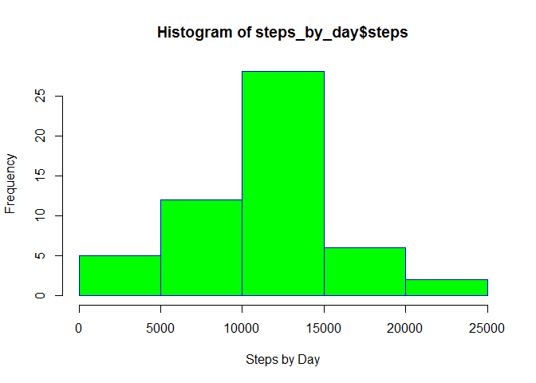
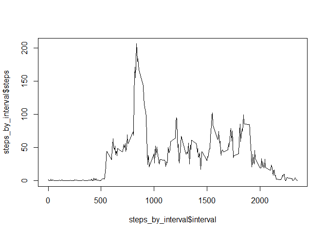
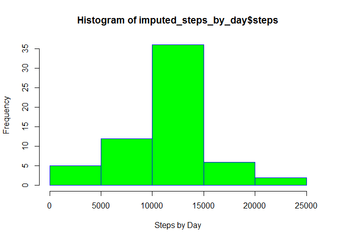
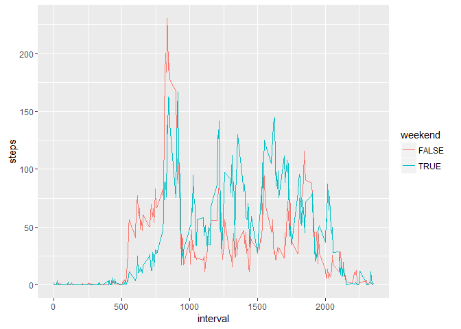

# PA1_template
# Coursera Data Science Specialization | Reproducible Research | Week 2 Peer Graded Assignment

## Loading and preprocessing the data

Download the file to the working directory and format:


```r
#if(!file.exists("activity.csv")) {
        fileURL <- "https://d396qusza40orc.cloudfront.net/repdata%2Fdata%2Factivity.zip"
        # Download file
        download.file(fileURL, destfile = "data.zip")
        # Unzip file and unlink the zip file
        data.zip <- unzip("data.zip")
        unlink("data.zip")
#}

# Unzip the file to workspace
data <- read.csv(data.zip,
                sep = ",")
```

## What is mean total number of steps taken per day?

Sum steps by day, create a histogram and caclulate mean and medians.


```r
# Sum steps by day
steps_by_day <- aggregate(steps ~ date, data, sum)
# Plot the histogram - y-axis of frequency and x-axis of steps by day
hist(steps_by_day$steps, xlab = "Steps by Day", ylab = "Frequency", border = "blue", col = "green")
```

<!-- -->

```r
# Mean and median total steps per day
steps_mean <- mean(steps_by_day$steps)
steps_median <- median(steps_by_day$steps)
```

The mean number of steps is 1.0766189\times 10^{4} and median is 10765.

## What is the average daily activity pattern?


```r
steps_by_interval <- aggregate(steps ~ interval, data, mean)
plot(steps_by_interval$interval,steps_by_interval$steps, type="l")
```

<!-- -->

```r
max_interval <- steps_by_interval[which.max(steps_by_interval$steps),1]
```

The interval with the average maximum number of steps per day is 835.

## Imputing missing values


```r
# The total number of missing values (coded as NA) in the dataset
incomplete <- sum(!complete.cases(data))
# Create a new dataset with the missing values filled in with the average for each interval
imputed_data <- transform(data, steps = ifelse(is.na(data$steps), steps_by_interval$steps[match(data$interval, steps_by_interval$interval)], data$steps))
# Sum steps by day
imputed_steps_by_day <- aggregate(steps ~ date, imputed_data, sum)
# Histogram of the total number of steps taken each data
hist(imputed_steps_by_day$steps, xlab = "Steps by Day", ylab = "Frequency", border = "blue", col = "green")
```

<!-- -->

```r
# Mean and median steps per day
i_steps_mean <- mean(imputed_steps_by_day$steps)
i_steps_median <- median(imputed_steps_by_day$steps)
# Do the values differ from prior to imputing NAs
steps_mean - i_steps_mean
```

```
## [1] 0
```

```r
steps_median - i_steps_median
```

```
## [1] -1.188679
```

## Are there differences in activity patterns between weekdays and weekends?


```r
# Convert the date from Factor to POSIXT
imputed_data$posixt <- as.POSIXct(imputed_data$date)
# Create a new variable for day
imputed_data$day <- weekdays(imputed_data$posixt)
# Determine if the day is a weekday or weekend
weekend <- c("Saturday", "Sunday")
imputed_data$weekend <- imputed_data$day %in% weekend
# Aggregate the data of the 5-minute interval and the average number of steps taken, averaged across all weekday days or weekend days
imputed_steps_by_interval <- aggregate(steps ~ weekend + interval, imputed_data, mean)
# Plot the data
library(ggplot2)
ggplot(data = imputed_steps_by_interval)+
        geom_line(aes(x=interval, y=steps, color=weekend))
```

<!-- -->
